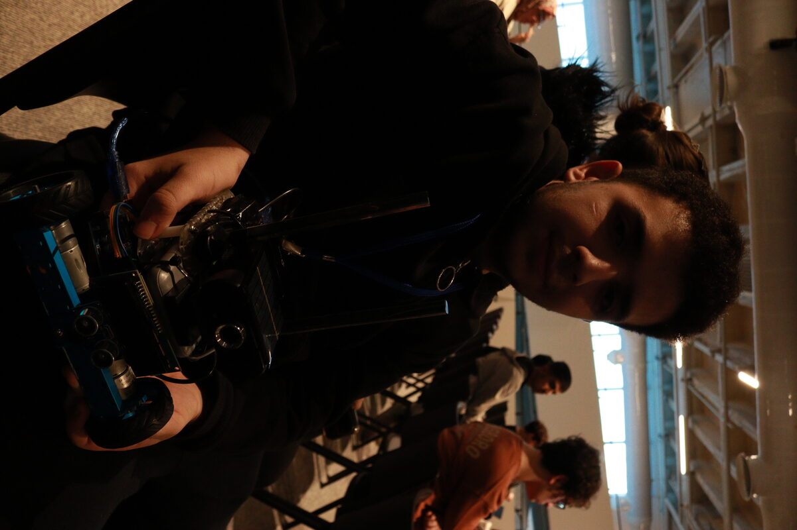
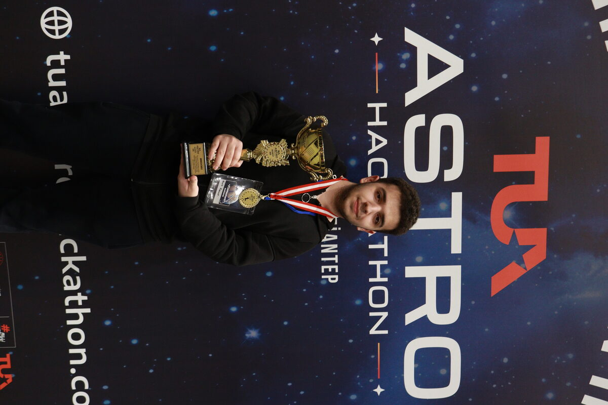

<p align="center">
  <a href="README.md">🇬🇧 <b>English</b></a> | <a href="README.tr.md">🇹🇷 <b>Türkçe</b></a>
</p>

# 🪐 Sol Cadente (Ahien-14) — Otonom Gezegen Keşif Aracı (Planetary Rover)

<div align=\"center\">

[](https://github.com/merwanted/sol-cadente-rover)
[](https://github.com/merwanted/sol-cadente-rover)
[-red?style=for-the-badge&labelColor=1a1a1a)](https://github.com/merwanted/sol-cadente-rover)
[](https://github.com/merwanted/sol-cadente-rover)
[](https://github.com/merwanted/sol-cadente-rover)

<p align=\"center\">
  <b>Türkiye Uzay Ajansı (TUA) Astro Hackathonu 1.lik Ödülü Kazanan Gezegen Gezgini Prototipi</b><br/>
  <i>Çok modlu Görsel Dil Modeli (VLM) destekli rota planlama, telemetri yer istasyonu ve Wi-Fi sinyali koptuğunda kendi izini sürerek geri dönen otonom fail-safe algoritması.</i>
</p>

</div>

---

<div align="center">
  
  
</div>

---

> ⚠️ **Proje Durumu:** Bu depo, **Türkiye Uzay Ajansı (TUA) Astro Hackathon** maratonu kapsamında **Sol Cadente** takımı tarafından 48 saatlik yarışma sürecinde geliştirilmiş, fiziki zorlu zemin parkurunda test edilmiş ve jüri önünde sergilenmiş **çalışan bir yarışma prototipidir (Competition MVP & Hardware Prototype)**.

---

## 📌 Problem ve Mühendislik Vizyonu

Ay ve Mars gibi zorlu gezegen yüzeylerinde otonom keşif araçlarının (Rover) karşılaştığı en kritik problemler:
1. **İletişim Kopması (Signal Shadowing):** Kraterler, kaya blokları veya toz fırtınaları nedeniyle yer istasyonu ile radyo/Wi-Fi telemetri bağlantısının aniden kesilmesi.
2. **Kör Engel Navigasyonu:** Sadece ultrasonik sensörlerin engebeli arazide yetersiz kalması; optik kamera görüntüsü ile anlamsal çevre algısının (Semantic Scene Understanding) zorunluluğu.
3. **Yol Verimliliği & Otonom Dönüş (RTH):** Görev tamamlandığında veya acil durumda aracın harcanan enerjiyi ve sapmaları minimize ederek güvenli üsse geri dönebilmesi.

**Ahien-14 (Sol Cadente)**, bu üç problemi gömülü donanım, yerel VLM yapay zekâsı ve otonom geri iz sürme yazılımıyla tek potada çözen uçtan uca bir sistemdir.

---

## 🏗️ Sistem Mimarisi

```
  ┌────────────────────────────────────────────────────────────────────────┐
  │                      SOL CADENTE ROVER MİMARİSİ                        │
  └───────────────────────────────────┬────────────────────────────────────┘
                                      │
     ┌────────────────────────────────┴────────────────────────────────┐
     ▼                                                                 ▼
【 🌍 YER İSTASYONU (Ground Control) 】                 【 🤖 ROVER DONANIMI (Onboard) 】
• Flask Web Dashboard (`dashboard.html`)                • Raspberry Pi 4 (Telemetri & Ağ İletişimi)
• OpenCV Canlı Video İşleme (640x480 MJPEG)            • Otonom Fail-Safe Geri Dönüş (`pi.py`)
• Çok Modlu Yapay Zekâ (Gemma 3:12B via Ollama)         • Arduino Donanım Sürücüsü (`car.ino`)
• 2D Rota Takipçisi (Dead-Reckoning Koordinat)          • L298N Çift H-Köprüsü (PWM Diferansiyel Sürüş)
• Görev Yönetim Motoru (`mission.json`)                 • HC-SR04 Ultrasonik Engel Algılama (<20cm)
• Tek Tıkla Otonom Üsse Dönüş (RTH)                    • DHT22 Sıcaklık/Nem & I2C 16x2 LCD Telemetri
```

---

## 🚀 Öne Çıkan Mühendislik Yetenekleri

### 1. 🛡️ Otonom Geri İz Sürme (Autonomous Fail-Safe Backtracking - `pi.py`)
Rover, yer istasyonuyla iletişim halindeyken aldığı her yön ve süre komutunu (`F 150`, `R 600` vb.) yerel hafızasındaki halka arabellekte (circular history) saklar.
* Yer istasyonu ile bağlantı koptuğunda (`WIFI LOST / Ping Timeout > 1.5s`):
* Sistem acil durum moduna geçer ve saklanan komutları anında tersine çevirir (`F` ➔ `B`, `L` ➔ `R`).
* Araç, kablosuz ağ sinyalini yeniden yakalayana kadar daha önce geçtiği fiziksel rotayı **ters sırayla otonom olarak adım adım geri kat eder**.

### 2. 👁️ Çok Modlu VLM Karar Döngüsü (Vision-Language Decision Loop - `server.py`)
Yer istasyonundaki sunucu, her döngüde rover kamerasından gelen kareyi, ultrasonik mesafe telemetrisini ve `mission.json` dosyasındaki hedef adımı yerel **Gemma 3 (12B)** görsel dil modeline sunar:
* Model engelleri analiz eder; hedefe güvenli yaklaşmak için kısa adımlar (`F 150`) veya açılı manevralar (`R 400`, `L 400`) önerir.
* Hedefe 20cm kala adımı başarıyla tamamlar (`NEXT`), aşılamayan engellerde güvenli sapma (`SKIP`) stratejisi uygular.

### 3. 🗺️ Dead-Reckoning Rota Takipçisi & Yol Metrikleri
Araç her hareket ettiğinde yer istasyonu trigonometrik yönelim (`heading`) ve mesafe formülleriyle 2D kartezyen koordinatlarını (`x`, `y`) gerçek zamanlı hesaplar:
* Yapılan her engelden kaçış manevrası "sapma (deviation)" olarak kaydedilir.
* Toplam yol verimliliği (`path_efficiency = forward / total_commands * 100`) canlı hesaplanarak ekrana yansıtılır.

---

## 🔌 Donanım & Pin Bağlantıları (`car.ino`)

| Donanım Bileşeni | Arduino Pini | İşlev |
| :--- | :---: | :--- |
| **HC-SR04 Ultrasonik** | Pin 2 (Trig), Pin 3 (Echo) | Anlık engel mesafesi tespiti & acil fren |
| **DHT22 Sensörü** | Pin 4 | Gezegen ortam sıcaklık ve nem telemetrisi |
| **L298N Sürücü (Sol)** | Pin 8 (IN1), Pin 9 (IN2), Pin 5 (ENA PWM) | Sol motorlar ileri/geri ve PWM hız kontrolü |
| **L298N Sürücü (Sağ)** | Pin 10 (IN3), Pin 11 (IN4), Pin 6 (ENB PWM) | Sağ motorlar ileri/geri ve PWM hız kontrolü |
| **I2C LCD (16x2)** | Pin A4 (SDA), Pin A5 (SCL) | Gövde üzerinde durum ve telemetri ekranı |
| **Raspberry Pi 4** | USB Seri (`/dev/ttyUSB0`) | 9600 Baud çift yönlü telemetri hattı |

---

## 📂 Depo Dosya Yapısı

```
sol-cadente-rover/
├── car.ino             # Arduino gömülü motor sürücüsü, sensör okuma ve otonom engelden kaçma
├── pi.py               # Raspberry Pi telemetri köprüsü ve Wi-Fi koptuğunda geri iz sürme algoritması
├── server.py           # Yer istasyonu, Gemma 3 VLM karar motoru, OpenCV video akışı ve dead-reckoning
├── mission.json        # Gezegen görevi adım/hedef tanımları (Square Patrol, Waypoints)
├── templates/          # Yer istasyonu canlı web arayüzleri
│   ├── dashboard.html  # Canlı kamera, telemetri göstergeleri, rota haritası ve olay logları
│   └── optimizer.html  # Görev simülasyon ve rota optimizasyon paneli
├── sim/                # Yükseklik haritası (heightmap) arazi simülasyonu
├── docs/               # Prototip donanım ve ödül töreni görselleri
├── LICENSE             # MIT Açık Kaynak Lisansı
├── README.md           # İngilizce Dokümantasyon (Varsayılan)
└── README.tr.md        # Türkçe Dokümantasyon
```

---

## 💻 Çalıştırma Rehberi

### 1. Arduino Sürücüsü:
`car.ino` dosyasını Arduino IDE üzerinden rover gövdesindeki Arduino Uno/Mega kartına yükleyin.

### 2. Rover Üzerinde (Raspberry Pi):
```bash
# Telemetri daemon'unu ve seri köprüyü başlatın
python3 pi.py
```

### 3. Yer İstasyonunda (Ground Control PC):
```bash
# Gereksinimleri yükleyin
pip install flask opencv-python requests

# Ollama üzerinde Gemma 3 multimodal modelini hazır bulundurun
ollama run gemma3:12b

# Yer kontrol sunucusunu başlatın
python3 server.py
```
Sunucu başladığında tarayıcınızdan `http://localhost:5000` adresine giderek telemetri kokpitine bağlanabilirsiniz.

---

## 🏆 Yarışma Başarısı & Takım

Bu proje, **Türkiye Uzay Ajansı (TUA)** tarafından düzenlenen **Astro Hackathon 2026**'da arazi testleri ve teknik jüri sunumu sonucunda **🥇 1.lik Ödülü (Şampiyonluk)** kazanmıştır.

* **Takım:** Sol Cadente
* **Takım Üyeleri:** Mert Özemir, Utku Öksüz ve ekip arkadaşları.
* **Mert Özemir Rolü:** Donanım ve devre mimarisi, Arduino sensör/motor katmanı, telemetri entegrasyonu ve otonom fail-safe sistemleri.
